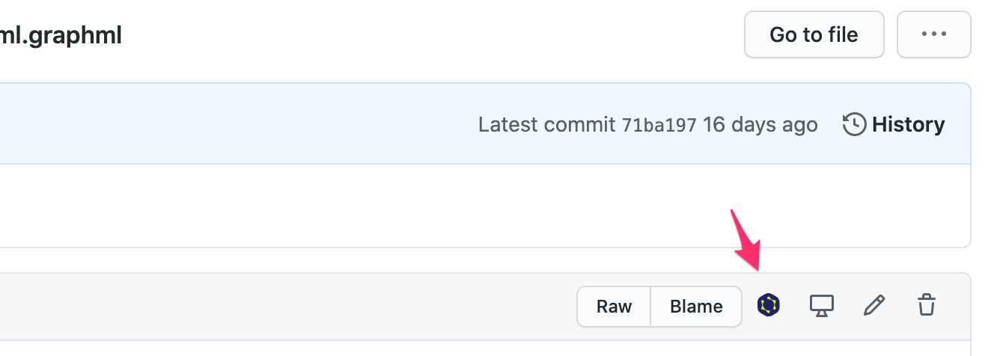

# yEd-github-chrome-extension

## Introduction

This chrome extension makes it easy to view `.graphml` files hosted on Github in the [yEd-live graph editor](https://www.yworks.com/yed-live/).

## Usage

1. After installing this chrome extension, navigate to a `.graphml` file hosted in a GitHub repository.
1. An icon will be added to the UI as shown below.
   * 
1. Click on the icon and a new tab will be opened in the [yEd-live graph editor](https://www.yworks.com/yed-live/) and you will be asked to open the file.
